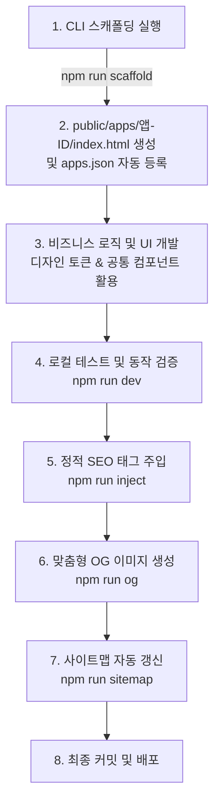

# eduin VIVES — 신규 앱 개발 가이드 및 배포 매뉴얼

이 문서는 eduin VIVES(labs)에 새로운 미니 웹 앱을 설계하고, 개발하고, SEO 및 메타데이터를 연결하여 최종 배포하는 프로세스를 안내합니다.

기존 디자인 시스템([design-system.md](file:///d:/Hwan/Documents/Web/byeduin-labs/docs/design-system.md))의 색상, 타이포그래피, 컴포넌트 규칙을 철저히 준수하여 일관성 있는 사용자 경험(UX)을 구축해야 합니다.

---

## 1. 신규 앱 추가 프로세스 한눈에 보기

새로운 미니 앱을 만들 때 거치는 전체 개발 흐름입니다:



---

## 2. Phase 1: CLI 스캐폴딩 실행

미니 앱 템플릿 파일 생성 및 레지스트리 수동 등록의 번거로움을 줄이기 위해 제공되는 대화형 CLI 도구를 실행합니다.

```bash
npm run scaffold
```

**유형을 먼저 고르고 기능을 채우는** 방식입니다. 실행 시 입력받는 정보:
1. **App ID**: URL 경로명이 될 영문 슬러그 (예: `my-calculator` → `/apps/my-calculator/`)
2. **App Name** · **Emoji** · **Short Description**
3. **Category / Subcategory**: `apps.json`의 `categories`(`edu`·`utility`)와 그 `subcategories` 중 선택 → 홈에 자동 배치
4. **Base(셸 유형)**: `column` · `split` · `sidebar` · `gallery` · `immersive`
5. **Width**: `narrow`(480) · `medium`(720) · `wide`(1120) — column/gallery에만
6. **플래그**: `focus`(아이템→전체화면) · `print`(A4)
7. **SEO Title / Description**

비대화형 한 줄 실행도 가능:
```bash
node scripts/scaffold-app.js --id my-app --name "내 앱" --base column --width narrow \
  --category edu --subcategory edu-work --emoji 🧮 --lucide puzzle --desc "..." [--focus] [--print]
# 모달/외부/다운로드 항목: --kind modal --href https://... --link-label "바로가기 ↗" --lucide puzzle [--external]
```

### 결과물 (한 커맨드로 완결)
- **디렉토리 생성**: `public/apps/[app-id]/index.html` — 선택한 베이스의 셸 골격
- **레지스트리 등록**: [apps.json](file:///d:/Hwan/Documents/Web/byeduin-labs/public/apps.json) `apps` 배열에 `subcategory` 포함 메타데이터 추가
- **후처리 자동 실행**: `inject-seo` → `generate-og --id <id>` → `generate-sitemap` 순차 실행 (canvas 미설치 시 OG만 경고 후 계속)

---

## 3. Phase 2: 기본 템플릿 구조와 리소스 참조

생성된 `public/apps/[app-id]/index.html`은 아래와 같은 기본 뼈대를 갖습니다.

```html
<!DOCTYPE html>
<html lang="ko">
<head>
  <meta charset="UTF-8">
  <meta name="viewport" content="width=device-width, initial-scale=1.0">
  <title>앱이름 — eduin VIVES</title>
  <!-- SEO 메타 태그 (빌드타임에 inject 스크립트로 오버라이드 됨) -->
  <meta name="description" content="SEO 설명 문구">
  <meta property="og:title" content="SEO 타이틀 | eduin VIVES">
  <meta property="og:description" content="SEO 설명 문구">
  <meta property="og:image" content="/og-images/앱-ID.png">
  <meta property="og:type" content="website">
  
  <link rel="icon" href="/favicon.svg" type="image/svg+xml">
  
  <!-- 공통 스타일·셸·스크립트 (필수) -->
  <link rel="stylesheet" href="/common/hero-theme.css">
  <link rel="stylesheet" href="/common/app-shell.css">
  <script src="/common/theme.js"></script>
  <script src="/common/init.js"></script>
  <script src="/common/app-shell.js" defer></script>
  <script src="/common/seo-injector.js" defer></script>

  <style>
    /* 앱 전용 스타일 */
  </style>
</head>
<!-- data-shell: column | split | sidebar | gallery | immersive
     data-width: narrow | medium | wide  (column/gallery에만)
     플래그: data-focus(아이템→전체화면, enterFocus()) · data-print(A4 인쇄) -->
<body data-shell="column" data-width="medium">
  <!-- 플로팅 크롬(좌상단 홈 / 우상단 테마·공유)은 app-shell.js가 자동 주입 — 복붙하지 않음 -->
  <main class="app-main">
    <div class="app-header">
      <div class="app-badge">◆ CATEGORY</div>
      <h1 class="app-title">🎭 앱이름</h1>
      <p class="app-desc">짧은 앱 설명</p>
    </div>
    <!-- 이 부분에 UI 구현 -->
  </main>
</body>
</html>
```

### 💡 공통 파일 3종의 동작 원리
- [hero-theme.css](file:///d:/Hwan/Documents/Web/byeduin-labs/public/common/hero-theme.css): 라이트/다크 모드 변수와 공통 컴포넌트(버튼, 입력 필드, 토스트, 헤더) 디자인을 제공합니다.
- [theme.js](file:///d:/Hwan/Documents/Web/byeduin-labs/public/common/theme.js): 렌더링 시 깜빡임(FOUC) 없이 로컬 스토리지 또는 시스템 설정의 다크 모드 테마를 HTML `data-theme` 속성에 동기식 적용합니다. 또한 공유(`shareCurrentPage()`) 팝업 및 토스트 UI 로직을 전역에서 바인딩합니다.
- [init.js](file:///d:/Hwan/Documents/Web/byeduin-labs/public/common/init.js): 통합 파비콘 브랜딩(`favicon.svg`)을 브라우저에 주입하고 구글 애널리틱스(GA4)를 초기화합니다.

---

## 4. Phase 3: 디자인 토큰 및 컴포넌트 설계 가이드

기존 미니 앱들과의 UI 일관성을 보존하기 위해 하드코딩된 스타일 대신 아래 클래스를 조립해 UI를 구축합니다.

### 4-1. 카드 레이아웃
단순한 사각형 배경 대신 일관성 있게 `.fd-card` 또는 `.hero-card`를 활용하십시오.
```html
<div class="fd-card">
  <h2 class="fd-section-title">설정 영역</h2>
  <!-- 카드 내용 -->
</div>
```

### 4-2. 입력 폼 & 폼 컨트롤
사용자 입력을 받는 요소에는 `.fd-input` (단일 텍스트), `.fd-textarea` (장문 입력, JetBrains Mono 고정 폰트 사용) 클래스를 적용합니다.
```html
<label class="fd-label">이름 입력</label>
<input type="text" class="fd-input" placeholder="이름을 입력하세요">
```

### 4-3. 버튼 변형
앱의 기능적 액션 성격에 맞춰 버튼을 선택합니다.
- **주요 실행(Primary)**: `<button class="fd-btn fd-btn-primary">실행</button>`
- **부차적 실행(Ghost)**: `<button class="fd-btn fd-btn-ghost">취소</button>`
- **위험/삭제(Danger)**: `<button class="fd-btn fd-btn-danger">삭제</button>`
- **작은 크기**: `.fd-btn-sm`을 결합하여 사용

---

## 5. Phase 4: 기능 구현 팁 (공유 및 알림)

### 5-1. 데이터 인코딩 & URL 단축 공유 패턴
대부분의 VIVES 앱은 사용자가 작성한 데이터를 서버 데이터베이스 없이 URL 해시 형태로 상대방과 공유할 수 있도록 설계되어 있습니다.
1. 저장하고 싶은 데이터를 JSON 문자열로 만든 후 Base64로 인코딩합니다.
   ```javascript
   const dataStr = JSON.stringify({ items: [...] });
   const hash = btoa(encodeURIComponent(dataStr));
   window.location.hash = hash;
   ```
2. 헤더의 "공유" 버튼을 눌렀을 때, `theme.js` 내에 내장된 `shareCurrentPage()` 함수가 호출되어 `/api/shorten` API를 통해 자동으로 짧은 단축 URL이 생성되고 클립보드에 복사됩니다.

### 5-2. 토스트(Toast) 메시지 출력
페이지 하단에 일시적으로 뜨는 알림창은 `theme.js`의 `showToast()` 함수를 사용하면 별도 UI 컴포넌트 선언 없이 바로 화면에 띄울 수 있습니다.
```javascript
// 알림 메시지 출력
showToast("클립보드에 복사되었습니다!");
```

### 5-3. 코드 기반 다기기 동기화(선택)
로그인·개인정보 없이 6자리 코드 하나로 여러 기기에서 상태를 이어쓰려면 `VivesSync`(`/common/sync.js`)를 쓴다. `<head>`에 `<script src="/common/sync.js"></script>`를 추가하고, 서버는 `functions/api/<app>.js`에서 `_sync.js`의 `createDocSync`/`createSetSync`를 한 줄로 래핑한 뒤 `migrations/`에 테이블을 추가한다. 클라이언트는 상태 자동 동기화면 `VivesSync.mountDocSync`, 다중 문서면 `VivesSync.docStore` + `mountCodeButton`을 사용한다. 자세한 설계·적용 절차는 [`docs/d1-sync-pattern.md`](d1-sync-pattern.md) 참고.

---

## 6. Phase 5: 배포 전 필수 배포용 스크립트 구동

개발 및 테스트가 끝났다면, 사이트 전반에 SEO 메타데이터와 사이트맵 규칙을 적용하기 위해 배포 준비 작업을 순차적으로 실행해야 합니다.

### 1단계: 정적 SEO 주입
`apps.json`에 정의된 최적화 SEO 타이틀과 설명 문구 및 JSON-LD 정보를 하위 앱 HTML에 일괄 정적 주입합니다.
```bash
npm run inject
```

### 2단계: 맞춤형 OG 이미지 빌드
포털 사이트, SNS 공유 시 나타날 1200x630 규격의 카테고리별 맞춤 브랜딩 카드 이미지를 Canvas 모듈로 렌더링해 냅니다.
```bash
npm run og
```

### 3단계: 사이트맵 갱신
새로운 하위 앱 URL을 탐색하여 크롤러 로봇들이 수집해갈 `sitemap.xml` 파일에 추가합니다.
```bash
npm run sitemap
```

---

## 7. 최종 체크리스트

커밋을 생성하여 메인 브랜치에 푸시하기 전, 다음 항목을 마지막으로 점검하세요:
- [ ] 다크 모드를 전환했을 때 배경(--bg) 및 텍스트(--fg), 카드 내의 UI 가시성이 우수한가?
- [ ] 입력 폼에 포커스했을 때 파란색 테두리(`--primary`) 포커스 링이 정상적으로 적용되는가?
- [ ] `apps.json`에 적힌 `seo.title`과 `seo.description`이 앱의 기획 의도를 명확히 드러내고 있는가?
- [ ] `npm run inject` 실행 후 `[app-id]/index.html` 헤더에 Canonical 및 JSON-LD, `seo-injector.js` 태그들이 정상 주입되었는지 확인했는가?
- [ ] `npm run sitemap` 실행 후 `public/sitemap.xml`에 새로운 앱의 URL 경로가 누락 없이 기재되어 있는가?
- [ ] `public/og-images/[app-id].png` 파일이 정상적으로 만들어져 들어갔는가?
